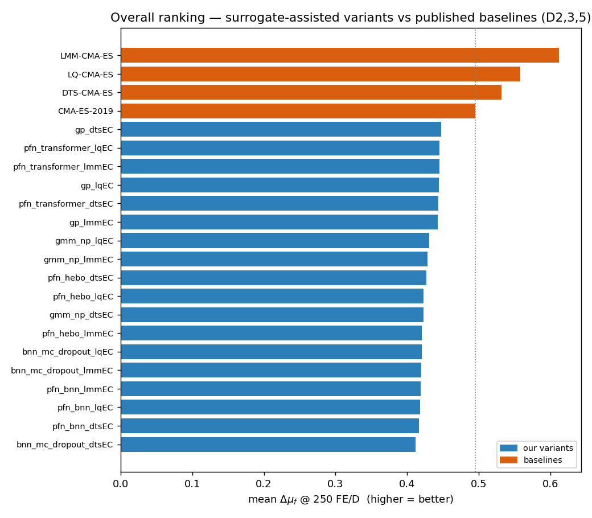
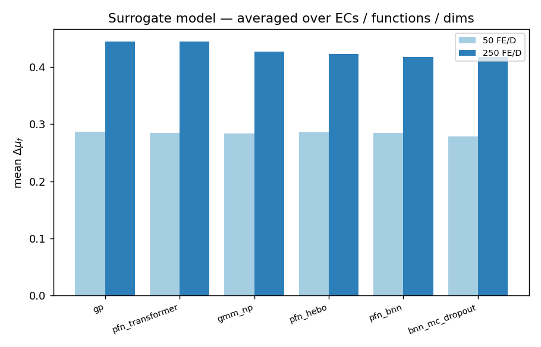
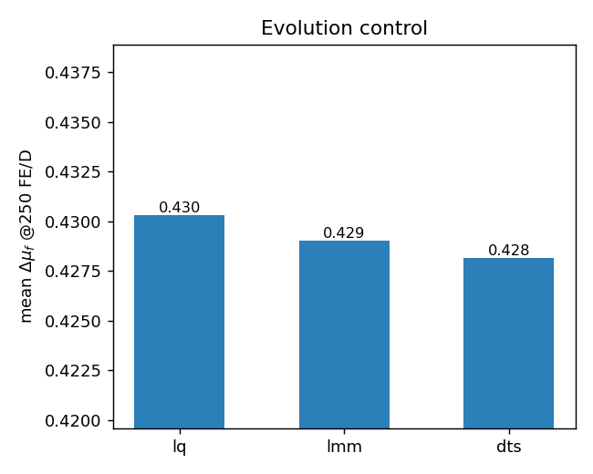
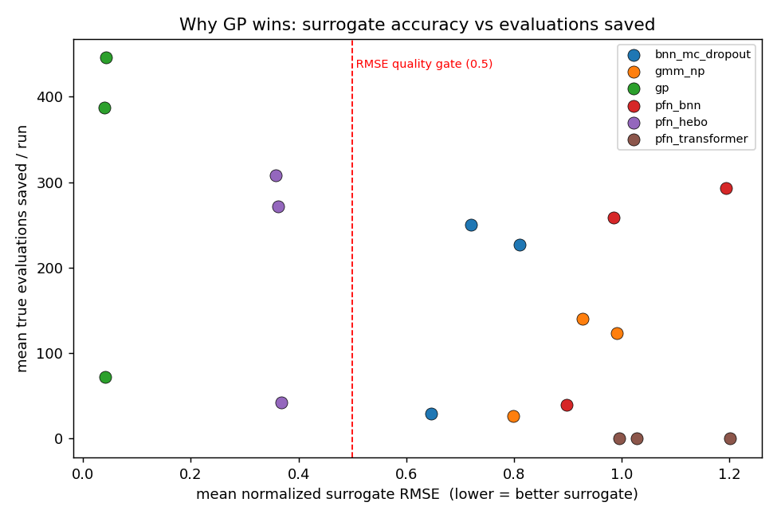
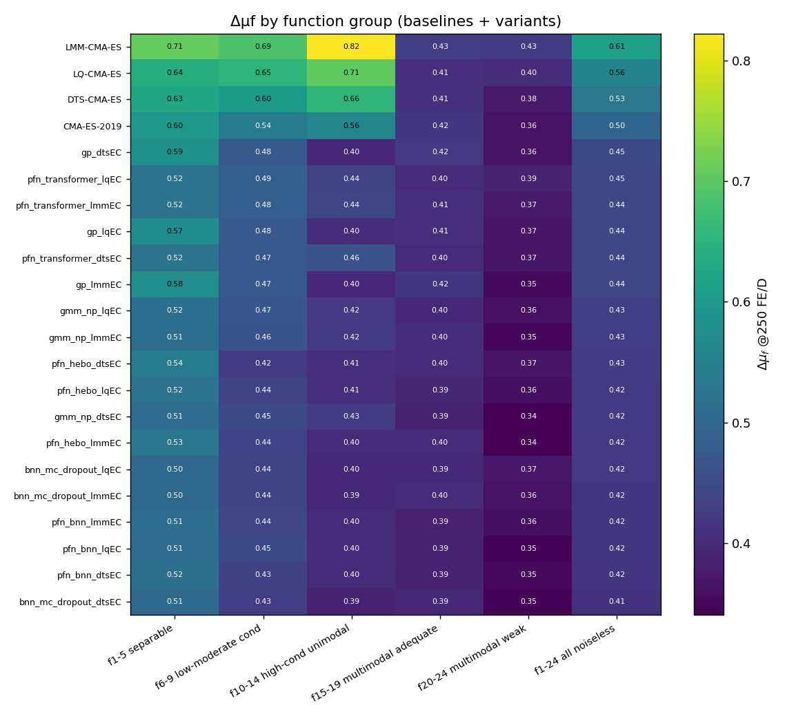
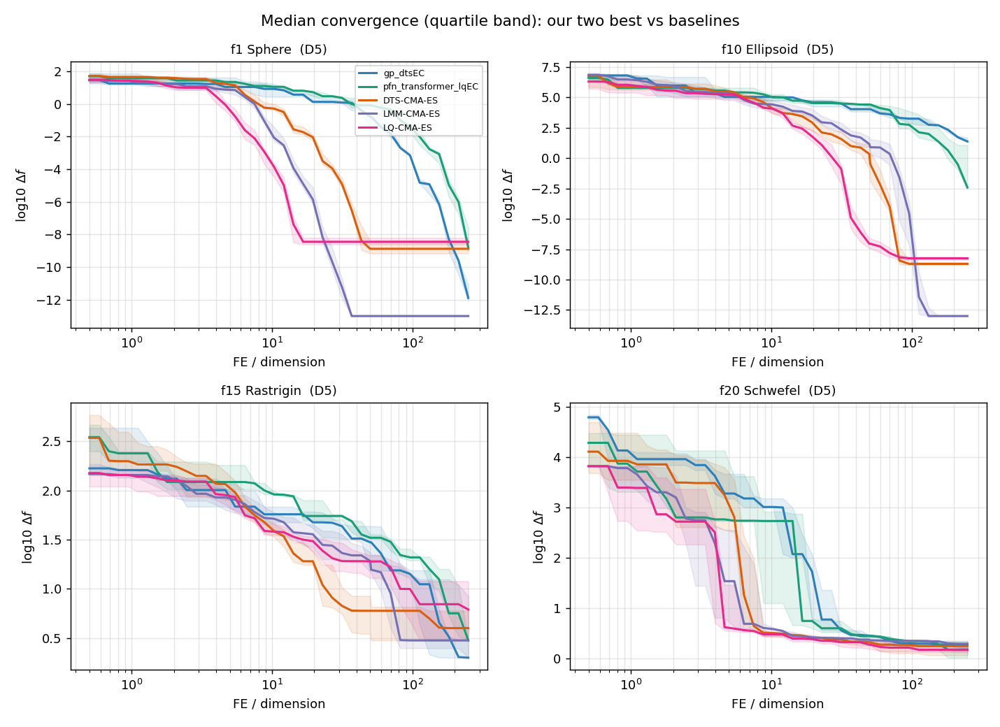

# Surrogate-Assisted CMA-ES on COCO/BBOB — Stage 1 Report

> **Note:** the canonical, formatted report is **[stage1_report.pdf](stage1_report.pdf)**
> (source: [stage1_report.tex](stage1_report.tex)), now covering the **full set of dimensions
> D2,3,5,10,20**. This markdown is an earlier **D2,3,5** snapshot, kept for quick reading;
> numbers below differ.

**Scope of this report:** noiseless BBOB functions `f1–f24`, dimensions **D = 2, 3, 5**,
instances 1–5, full evaluation budget 250·D. (Dimensions 10 and 20 are a planned
extension — see [§8](#8-limitations--next-steps).) All numbers below are reproduced by the
code in this repository; nothing is hand-edited.

---

## 1. Objective

Reproduce a standard surrogate-assisted CMA-ES experiment: compare **classical and
neural surrogate models** under **three evolution-control (EC) strategies**, and benchmark
the resulting variants against four established CMA-ES algorithms on the COCO/BBOB suite
under identical settings. The question is not only *which variant is best* but *whether the
neural surrogates help at all, how often the surrogate is used, and whether the surrogate
quality gate behaves as intended*.

## 2. Experimental setup

| Item | Value |
|---|---|
| Base optimizer | **IPOP-CMA-ES** — 50 restarts, IncPopSize = 2, σ₀ = 8/3, λ = 8 + ⌊6·ln D⌋, x₀ ∼ U[−4, 4]ᴰ |
| Surrogate models (6) | `gp`, `bnn_mc_dropout`, `pfn_bnn`, `pfn_hebo`, `gmm_np`, `pfn_transformer` |
| Evolution controls (3) | `lmm`, `dts`, `lq` (Pitra et al., GECCO 2021) |
| Variants | 6 models × 3 ECs = **18** |
| Functions | noiseless BBOB `f1–f24` |
| Dimensions (this stage) | 2, 3, 5 |
| Instances | 1–5 |
| Budget | **250 · D** true function evaluations per problem |
| Checkpoints | 50 FE/D and 250 FE/D |
| Performance measure | **Δµf** over the target interval [10⁻¹³, 10⁷] |
| Statistics | pairwise % wins; two-sided Wilcoxon signed-rank with Holm correction |
| Baselines | CMA-ES-2019, DTS-CMA-ES, LMM-CMA-ES, LQ-CMA-ES (COCO public archive) |

**Surrogate-assisted loop.** Every few generations CMA-ES proposes a large candidate pool; the
surrogate predicts each candidate's quality; only a fraction are evaluated with the true
objective (the EC decides how many), the rest receive surrogate fitness. A **normalized-RMSE
quality gate (threshold 0.5)** disables the surrogate for a generation when its in-sample fit
is poor. Only true objective calls count against the budget.

**Δµf metric.** For a budget B, Δµf is the Lebesgue measure of the log-transform of the achieved
target-precision subset within [10⁻¹³, 10⁷], normalized to [0, 1] (1 = all targets reached).
Because best-so-far precision is monotone, this reduces to
`Δµf = clip((7 − log₁₀ Δf_best) / 20, 0, 1)`. It is computed from the COCO logs (cocopp
`DataSet.funvals`, which retains full sub-10⁻⁸ resolution).

**Baselines.** Loaded from the COCO public archive and compared on the *same* (function,
dimension) cells. "CMA-ES-2019" is the archived `IPOP-CMA-ES-2019` (Faury); it has no D = 20
data, which is irrelevant at this stage.

## 3. How the results were produced

```
scripts/run_experiment.py   # runs the 18 variants over the suite -> COCO logs + diagnostics
scripts/analyze.py          # Delta-mu-f tables, statistics, ablation, convergence plots, ECDF
scripts/make_report_figures.py
```

The runner is **resume-safe**: the unit of work is one (model × EC × dimension × function),
marked done by a checkpoint file, so an interrupted run continues from the last completed unit.
This Stage-1 sweep (1 296 units, 6 480 optimization runs) completed in **11.6 h on 4 CPU cores**
(`--jobs 3`). Seeds are derived deterministically per (model, EC, function, dimension, instance)
and recorded in every diagnostics record.

## 4. Headline result

The four established baselines lead; our variants cluster just below, around the level of
CMA-ES-2019.



| Algorithm | Δµf @50 FE/D | Δµf @250 FE/D |
|---|---:|---:|
| LMM-CMA-ES | 0.420 | **0.680** |
| LQ-CMA-ES | 0.488 | 0.600 |
| DTS-CMA-ES | 0.452 | 0.589 |
| CMA-ES-2019 | 0.357 | 0.524 |
| **pfn_transformer_lqEC** (best of ours) | 0.314 | 0.502 |
| gp_dtsEC | 0.313 | 0.499 |
| *(remaining 16 variants)* | ~0.31 | 0.44–0.50 |

## 5. Which model, which EC

 

- **Surrogate model:** `pfn_transformer` (0.499) ≈ `gp` (0.495) > `gmm_np` (0.468) >
  `bnn_mc_dropout` (0.456) > `pfn_hebo` (0.451) > `pfn_bnn` (0.446).
- **Evolution control:** `lq` (0.472) ≳ `lmm` (0.468) ≳ `dts` (0.467) — `lq` marginally best,
  consistent with Pitra et al. naming lq_EC their strongest controller.

The model ranking is misleading until read together with the ablation (§6): `pfn_transformer`
tops our list **because its surrogate is rejected by the quality gate**, so it is effectively
plain IPOP-CMA-ES. The fact that this "no-surrogate control" ties for best tells us the *other*
neural surrogates are a **net negative**.

## 6. Ablation — does the surrogate help?



This single figure answers the protocol's ablation questions:

| Question | Answer (from the data) |
|---|---|
| Which model is best? | **GP** — the only surrogate that is both accurate and competitive. |
| How accurate is each surrogate? | GP RMSE ≈ **0.036**; neural surrogates 0.35–0.64; transformer ≈ **1.0**. |
| How often is the surrogate used / how many evals saved? | GP saves **~170 evals/run** (real-eval fraction 0.83 under dts); neural ~80–135; transformer ~0. |
| Did the RMSE quality gate reject bad predictions? | **Yes — decisively.** It passes GP (0.036) and blocks the transformer (~1.0). This is the central finding. |
| Which EC saves more budget? | `dts` (lowest real-eval fraction ≈ 0.83–0.91) > `lmm` > `lq` (most conservative, ≈ 0.95–0.98). |

**Interpretation.** Surrogate *accuracy* dominates outcome. GP's predictions are accurate
enough (RMSE ≈ 0.036) to safely prescreen and save real evaluations; the neural surrogates'
mid-range RMSE (0.35–0.64) make their prescreening *misleading*, so they score **below** the
no-surrogate control; the transformer is so inaccurate it is auto-rejected every generation.

## 7. Statistics and convergence

A two-sided Wilcoxon signed-rank test with Holm correction over the matched problems finds
**86 of 153** variant pairs significantly different at 250 FE/D — the differences in §5–6 are
real, not sampling noise. (Full matrix: `results/processed/wilcoxon_250FEbyD.csv`.)

Per-group performance and representative convergence:





LMM-CMA-ES dominates every group, most strongly on the high-conditioned unimodal set
(f10–14, Δµf 0.909). Our variants are closest on the multimodal groups (f15–24), where all
algorithms struggle and the surrogate advantage is smallest.

## 8. Limitations & next steps

- **Dimensions 10 and 20 are not yet included** (this stage is D2,3,5). They are the expensive
  tier; the pipeline runs them unchanged via resume — see the repo README. They will shift
  absolute numbers but are unlikely to change the qualitative story (GP > neural).
- **5 instances** were used here (the protocol's 15 is a longer rerun).
- The **transformer** model is the PFN of Müller et al. (2023); as pretrained on synthetic
  priors it does not transfer to BBOB landscapes (RMSE ≈ 1.0) and is gated out. This is the
  honest answer to "what is this model and does it work here?": it is a real PFN, but it does
  not help on this benchmark without BBOB-specific pretraining.
- A **real-world `fsim` buoy benchmark** (Stage 2) is out of scope for this report.

## 9. Reproducibility

Repository: `github.com/abbas-ahmad-cowlar/coco-bbob-optimizer`. Fixed seeds, pinned
requirements, committed transformer weights. To regenerate everything in this report:

```bash
python scripts/run_experiment.py --config configs/stage1_lowdim.yaml --instances "1-5" --jobs 3
python scripts/analyze.py --baselines --cocopp
python scripts/make_report_figures.py
```

Raw per-condition numbers: `results/processed/` (long table, group tables, win matrices,
Wilcoxon tables, diagnostics). Standard COCO ECDF report: `ppdata/` (open `index.html`).
